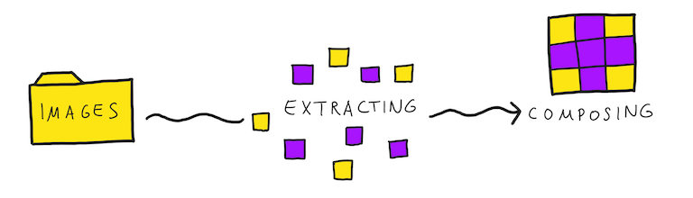
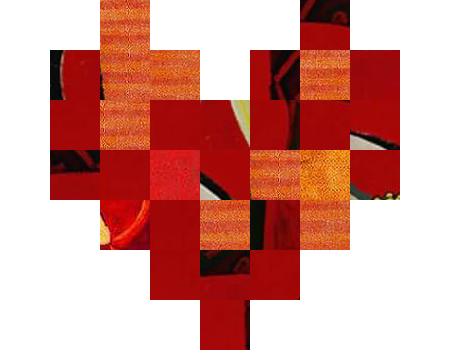

# img2pimg

`img2pimg` looks for squares with specific size in images, that have a overall given color. In a second step the algorithm uses all gatheres squares to create a new image by a given template, where each pixel is represented by one square.



# Getting started

In this example we are using *165* paintings from Picasso as source and creating a heart. The `source` is the directory name of folder with images.

**Creating a template with 2d array**

```python
template = [
    [None, None, 'red', None, None, None, 'red', None, None],
    [None, 'red', 'red', 'red', None, 'red', 'red', 'red', None],
    [None, 'red', 'red', 'red', 'red', 'red', 'red', 'red', None],
    [None, 'red', 'red', 'red', 'red', 'red', 'red', 'red', None],
    [None, None, 'red', 'red', 'red', 'red', 'red', None, None],
    [None, None, None, 'red', 'red', 'red', None, None, None],
    [None, None, None, None, 'red', None, None, None, None]
]
```

**Initialize an object from `Img2Pimg` class**

```python
i2p = Img2Pimg("picasso", template, th=60)
```

**Running and display the image**

```python
i2p.run()
i2p.img_
```



