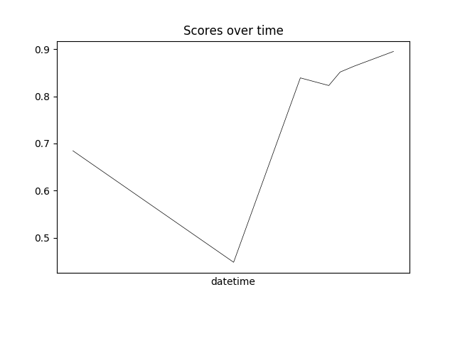

# ppipeline

The goal is to develop a python library that implements a time series forecasting pipeline, using *state-of-the-art* techniques. `ppipeline` follows an error driven approach. Each progress in the code, will be tested on multiple time series data and against a benchmark. The developement will follow the progression in the scores:

```
1.0 = Benchmark
```



